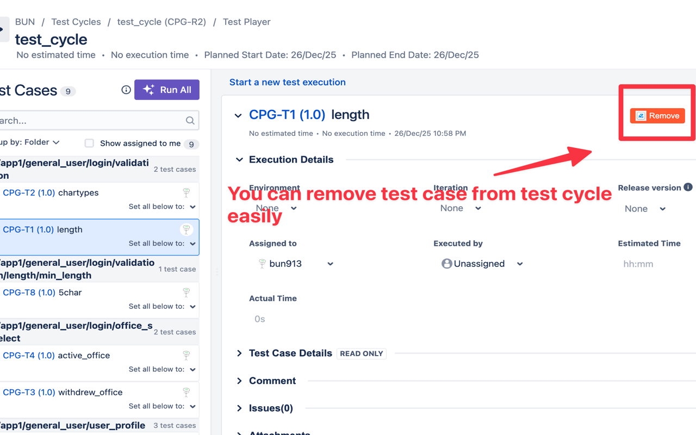
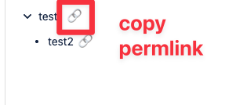

# Zephyr UI Extension

UI enhancements for Zephyr Test Management. This Chrome extension adds productivity features to Zephyr Scale's Test Runner interface.

## Features

### 1. Remove Test Case from Test Cycle



- **What**: Add a "Remove" button to the Test Runner screen to quickly remove test cases from test cycles
- **Why**: Normally, you need to navigate back to the Test Cycle list to remove test cases. This extension allows you to do it directly from the Test Runner.
- **How**: Click the red "Remove" button next to the test execution controls

### 2. Shareable Links to Folders



- **What**: Generate permanent links to specific folders in the Test Cases view
- **Why**: Zephyr doesn't update the URL when you navigate folders, making it impossible to bookmark or share specific folder locations. This extension solves that problem.
- **How**:
  - Click the 🔗 icon next to any folder name in the Test Cases page
  - The link is copied to your clipboard with visual feedback ("✓ Copied!")
  - Share the link with others or bookmark it
  - When opened, the extension automatically searches for the folder, expands it, and selects it

## Tech Stack

- **TypeScript**: Type-safe development
- **Vite**: Fast build tool with HMR support
- **CRXJS Vite Plugin**: Chrome extension development with Vite
- **Biome**: Fast formatter and linter
- **Manifest V3**: Latest Chrome extension format

## Project Structure

```
src/
├── common/
│   ├── constants.ts     # Constants (API URLs, selectors, etc.)
│   ├── logger.ts        # Logger (dev/prod mode switching)
│   ├── auth.ts          # Authentication (JWT token handling)
│   ├── url.ts           # URL parsing utilities
│   └── api.ts           # API request functions
├── removeTestCaseFromTestRun/
│   ├── ui.ts            # Button UI and DOM manipulation
│   ├── remove.ts        # Business logic for removal
│   └── index.ts         # Entry point for this feature
├── openFolderInTestCases/
│   ├── autoExpand.ts    # Auto-expand folder from URL parameters
│   ├── linkButton.ts    # Link icon button to generate folder URLs
│   └── index.ts         # Entry point for this feature
└── content.ts           # Main content script (initialization)
```

## Design Principles

### Modular Architecture

Each feature is isolated in its own directory under `src/`, making it easy to add new features without affecting existing ones.

### Logger System

Development and production logs are separated:
- **Development** (`npm run dev`): All debug logs are shown
- **Production** (`npm run build`): Only info and error logs are shown

### Non-intrusive API Usage

The extension uses Zephyr's internal API endpoints. While these are not public APIs, the extension:
- Only uses existing session cookies
- Makes the same requests as the web UI
- Does not send data to external servers

## Development

### Prerequisites

- Node.js 22.11.0 or higher
- Chrome browser

### Setup

```bash
# Install dependencies
npm install
```

### Build

```bash
# Development build (with debug logs)
npm run dev

# Production build (minimal logs)
npm run build
```

### Format & Lint

```bash
# Format code
npm run format

# Lint code
npm run lint

# Check and fix both
npm run check
```

## Installation

### For Development

1. Build the extension:
   ```bash
   npm run build
   ```

2. Open Chrome and navigate to `chrome://extensions/`

3. Enable "Developer mode" (toggle in top-right)

4. Click "Load unpacked" and select the `dist` directory

5. Navigate to a Zephyr Test Runner page to see the extension in action

### For Production

After building with `npm run build`, the extension can be packaged and distributed.

## Usage

### Remove Test Case Feature

1. Open a Test Runner page in Zephyr Scale (URL contains `#!/v2/testPlayer/`)
2. A red "Remove" button will appear next to the test execution controls
3. Click the button to remove the current test case from the test cycle
4. The page will automatically reload to reflect the changes

### Folder Link Feature

1. Open the Test Cases page in Zephyr Scale (URL contains `#!/v2/testCases`)
2. Navigate to any folder - you'll see a 🔗 icon next to each folder name
3. Click the icon to copy a permanent link to that folder
4. Share the link or use it later - when opened, the folder will automatically expand and be selected

## Future Plans

This extension is designed to support multiple productivity features for Zephyr Test Management. The "Remove Test Case" feature is just the first implementation.

Planned features:
- Additional quick actions for test management
- Keyboard shortcuts
- Batch operations
- And more...

## Technical Notes

### iframe Support

Zephyr runs in an iframe, so the extension uses `all_frames: true` in the manifest to ensure the content script runs in both the main frame and the iframe.

### API Authentication

The extension uses JWT tokens from cookies to authenticate API requests, matching the same authentication method used by the Zephyr web interface.

### Folder Link Implementation

The folder link feature leverages Zephyr's built-in search functionality to navigate to folders. Since Zephyr doesn't provide official APIs or URL parameters for folder navigation, the extension:
- Uses the search feature to locate folders
- Simulates user interactions (typing, clicking)
- Relies on `data-testid` attributes for DOM selection

**Note**: This implementation may be fragile and could break if Zephyr updates its UI structure or search behavior. However, using `data-testid` attributes (which are used for Zephyr's own testing) provides better stability than CSS class names.

### Build Artifacts

- `*.pem`: Private key for extension signing (not committed to git)
- `*.crx`: Packaged extension file (not committed to git)
- `dist/`: Build output directory (not committed to git)
